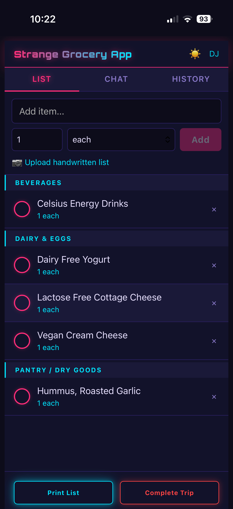

# Strange Grocery App

A self-hosted, collaborative grocery list app with Claude AI integration. Manage your grocery list in real time across multiple devices, get recipe suggestions from Claude, and parse handwritten lists via photo upload.



## Features

- **Real-time shared lists** — multiple users see updates instantly via Socket.io
- **Auto-categorization** — items are sorted by department (Produce, Dairy, Meat, etc.) using a rule-based system with a learned cache and Claude Haiku as fallback
- **Claude chat** — ask for recipe ideas, meal plans, or add items by chat; Claude has context of your current list and last 10 trip histories
- **Photo-to-list** — snap a photo of a handwritten list; Claude vision parses and adds items automatically
- **Shopping mode** — check off items while in-store
- **Trip history** — completed lists are saved; browse history and copy past trips to a new list
- **Print view** — organized by department, optimized for printing
- **Autocomplete** — item name suggestions drawn from your history
- **Synthwave UI** — mobile-first responsive design with Orbitron font and neon glow effects

## Tech Stack

| Layer | Choice |
|-------|--------|
| Frontend | Vue 3 + Vite |
| Backend | Node.js + Express |
| Real-time | Socket.io |
| Database | MariaDB |
| AI | Anthropic Claude API (Haiku + Sonnet) |

## Prerequisites

- [Git](https://git-scm.com/downloads)
- [Docker Desktop](https://docs.docker.com/get-docker/) (includes Docker Compose) — available for Windows, Mac, and Linux
- An [Anthropic API key](https://console.anthropic.com/)

> **Windows users:** All commands below should be run in **PowerShell** or **Git Bash**. Docker Desktop must be running before you start.

## Installation

### 1. Clone the repository

```bash
git clone https://github.com/dirkstrange/Strange-Grocery-App.git
cd Strange-Grocery-App
```

### 2. Configure environment variables

**Mac / Linux:**
```bash
cp .env.example .env
```

**Windows (PowerShell):**
```powershell
copy .env.example .env
```

Now open `.env` in a text editor and fill in your values.

> **Tip:** `.env` is a hidden file (its name starts with a dot). On Mac use `cmd+shift+.` in Finder to show hidden files. On Windows, enable "Show hidden items" in File Explorer. Or open it directly from your terminal with `nano .env` (Mac/Linux) or `notepad .env` (Windows).

```env
PORT=3000

DB_HOST=db
DB_PORT=3306
DB_NAME=grocery_app
DB_USER=grocery_user
DB_PASSWORD=your_secure_password_here
DB_ROOT_PASSWORD=your_secure_root_password_here

ANTHROPIC_API_KEY=your_anthropic_api_key_here
```

**What to change:**
- `DB_PASSWORD` — choose any password (make it strong; you won't need to type it again)
- `DB_ROOT_PASSWORD` — choose any password; required by MariaDB to initialize. The app never uses this directly.
- `ANTHROPIC_API_KEY` — paste your key from [console.anthropic.com](https://console.anthropic.com/)

**Leave these as-is:**
- `DB_HOST=db`, `DB_NAME=grocery_app`, `DB_USER=grocery_user`, `DB_PORT=3306` — these are pre-configured for Docker and should not be changed

### 3. Start the app

```bash
docker compose up --build
```

The app will be available at `http://localhost:3000`.

On first run, Docker will:
- Pull the MariaDB image and initialize the database schema automatically
- Build the Vue frontend
- Start the Node.js backend

> **Note:** First startup takes 30–60 seconds. MariaDB needs time to initialize before the app can connect. This is normal — wait for the log line `Grocery App server running on port 3000` before opening the browser.

To run in the background (detached mode):

```bash
docker compose up --build -d
```

Subsequent starts (no code changes):

```bash
docker compose up -d
```

## Accessing from other devices

Since this is a shared grocery list, you'll likely want to open it on your phone or other devices on the same network.

Find your computer's local IP address:
- **Mac:** System Settings → Wi-Fi → Details
- **Linux:** `ip a` in terminal
- **Windows:** `ipconfig` in PowerShell, look for IPv4 Address

Then open `http://YOUR_LOCAL_IP:3000` on any device on the same network (e.g. `http://192.168.1.100:3000`).

## Logs

To view live logs:

```bash
docker compose logs -f
```

To view logs for a specific service:

```bash
docker compose logs -f app
docker compose logs -f db
```

## Stopping the app

```bash
docker compose down
```

Database data is persisted in a Docker volume and survives restarts. To wipe all data:

```bash
docker compose down -v
```

## Updating

```bash
git pull
docker compose up --build -d
```

## Configuration notes

- **Port** — defaults to `3000`. Change `PORT` in `.env` and update the port mapping in `docker-compose.yml` if needed.
- **External access** — the app works behind a reverse proxy (nginx, Caddy, Traefik). Set your proxy to forward to port 3000.
- **Multiple users** — no account system is required. Users enter a display name on first visit, stored in localStorage.

## License

MIT
